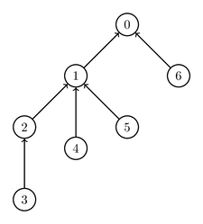
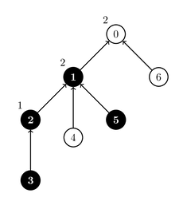
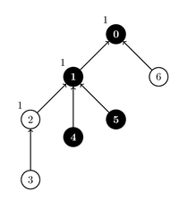

# Digital Circuit

There is a circuit, which consists of $N + M$ **gates** numbered from $0$ to $N + M - 1$.
Gates $0$ to $N - 1$ are **threshold gates**, whereas gates $N$ to $N + M - 1$ are **source gates**.

Each gate, except for gate $0$, is an **input** to exactly one threshold gate.
Specifically, for each $i$ such that $1 \le i \le N + M - 1$, gate $i$ is an input to gate $P[i]$, where $0 \le P[i] \le N-1$.
Importantly, we also have $P[i] \lt i$.
Moreover, we assume $P[0] = -1$.
Each threshold gate has one or more inputs.
Source gates do not have any inputs.

Each gate has a **state** which is either $0$ or $1$.
The initial states of the source gates are given by an array $A$ of $M$ integers.
That is, for each $j$ such that $0 \le j \le M - 1$, the initial state of the source gate $N + j$ is $A[j]$.

The state of each threshold gate depends on the states of its inputs and is determined as follows.
First, each threshold gate is assigned a threshold **parameter**.
The parameter assigned to a threshold gate with $c$ inputs must be an integer between $1$ and $c$ (inclusive).
Then, the state of a threshold gate with parameter $p$ is $1$, if at least $p$ of its inputs have state $1$, and $0$ otherwise.

For example, suppose there are $N = 3$ threshold gates and $M = 4$ source gates.
The inputs to gate $0$ are gates $1$ and $6$, the inputs to gate $1$ are gates $2$, $4$, and $5$, and the only input to gate $2$ is gate $3$.

This example is illustrated in the following picture.



Suppose that source gates $3$ and $5$ have state $1$, while source gates $4$ and $6$ have state $0$.
Assume we assign parameters $1$, $2$ and $2$ to threshold gates $2$, $1$ and $0$ respectively. 
In this case, gate $2$ has state $1$, gate $1$ has state $1$ and gate $0$ has state $0$. 
This assignment of parameter values and the states is illustrated in the following picture.
Gates whose state is $1$ are marked in black.



The states of the source gates will undergo $Q$ updates.
Each update is described by two integers $L$ and $R$ ($N \le L \le R \le N + M - 1$) and toggles the states of all source gates numbered between $L$ and $R$, inclusive.
That is, for each $i$ such that $L \le i \le R$, source gate $i$ changes its state to $1$, if its state is $0$, or to $0$, if its state is $1$.
The new state of each toggled gate remains unchanged until it is possibly toggled by one of the later updates.

Your goal is to count, after each update, how many different assignments of parameters to threshold gates result in gate $0$ having state $1$.
Two assignments are considered different if there exists at least one threshold gate that has a different value of its parameter in both assignments.
As the number of ways can be large, you should compute it modulo $1\;000\;002\;022$.

Note that in the example above, there are $6$ different assignments of parameters to threshold gates, since gates $0$, $1$ and $2$ have $2$, $3$ and $1$ inputs respectively.
In $2$ out of these $6$ assignments, gate $0$ has state $1$.


## Implementation Details

Your task is to implement two procedures.

```
void init(int N, int M, int[] P, int[] A)
```

* $N$: the number of threshold gates.
* $M$: the number of source gates.
* $P$: an array of length $N + M$ describing the inputs to the threshold gates.
* $A$: an array of length $M$ describing the initial states of the source gates.
* This procedure is called exactly once, before any calls to `count_ways`.

```
int count_ways(int L, int R)
```

* $L$, $R$: the boundaries of the range of source gates, whose states are toggled. 
* This procedure should first perform the specified update, and then return the number of ways, modulo $1\;000\;002\;022$, of assigning parameters to the threshold gates, which result in gate $0$ having state $1$.
* This procedure is called exactly $Q$ times.


## Example

Consider the following sequence of calls:

```
init(3, 4, [-1, 0, 1, 2, 1, 1, 0], [1, 0, 1, 0])
```

This example is illustrated in the task description above.

```
count_ways(3, 4)
```

This toggles the states of gates $3$ and $4$, i.e. the state of gate $3$ becomes $0$, and the state of gate $4$ becomes $1$.
Two ways of assigning the parameters which result in gate $0$ having state $1$ are illustrated in the pictures below.

| Way $1$ | Way $2$ |
|:-------:|:-------:|
|  |  |

In all other assignments of parameters, gate $0$ has state $0$.
Thus, the procedure should return $2$.

```
count_ways(4, 5)
```

This toggles the states of gates $4$ and $5$.
As a result, all source gates have state $0$, and for any assignment of parameters, gate $0$ has state $0$.
Thus, the procedure should return $0$.

```
count_ways(3, 6)
```

This changes the states of all source gates to $1$.
As a result, for any assignment of parameters, gate $0$ has state $1$.
Thus, the procedure should return $6$.


## Constraints

* $1 \le N, M \le 100\;000$
* $1 \le Q \le 100\;000$
* $P[0] = -1$
* $0 \le P[i] \lt i$ and $P[i] \le N - 1$ (for each $i$ such that $1 \le i \le N + M - 1$)
* Each threshold gate has at least one input (for each $i$ such that $0 \le i \le N - 1$ there exists an index $x$ such that $i \lt x \le N + M - 1$ and $P[x] = i$).
* $0 \le A[j] \le 1$ (for each $j$ such that $0 \le j \le M - 1$)
* $N \le L \le R \le N + M - 1$


## Subtasks

1. (2 points) $N = 1$, $M \le 1000$, $Q \le 5$
1. (7 points) $N, M \le 1000$, $Q \le 5$, each threshold gate has exactly two inputs.
1. (9 points) $N, M \le 1000$, $Q \le 5$
1. (4 points) $M = N + 1$, $M = 2^z$ (for some positive integer $z$), $P[i] = \lfloor\frac{i - 1}{2}\rfloor$ (for each $i$ such that $1 \le i \le N + M - 1$), $L = R$
1. (12 points) $M = N + 1$, $M = 2^z$ (for some positive integer $z$), $P[i] = \lfloor\frac{i - 1}{2}\rfloor$ (for each $i$ such that $1 \le i \le N + M - 1$)
1. (27 points) Each threshold gate has exactly two inputs.
1. (28 points) $N, M \le 5000$
1. (11 points) No additional constraints.


## Sample Grader

The sample grader reads the input in the following format:

* line $1$: $N \; M \; Q$
* line $2$: $P[0] \; P[1] \; \ldots \; P[N + M - 1]$
* line $3$: $A[0] \; A[1] \; \ldots \; A[M - 1]$
* line $4 + k$ ($0 \le k \le Q - 1$): $L \; R$ for update $k$

The sample grader prints your answers in the following format:

* line $1 + k$ ($0 \le k \le Q - 1$): the return value of `count_ways` for update $k$
