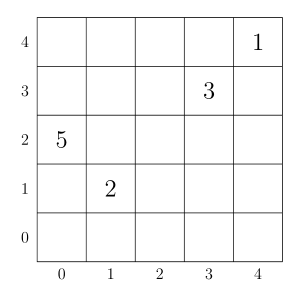
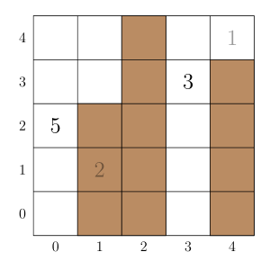

# Catfish Farm

Bu Dengklek owns a catfish farm.
The catfish farm is a pond consisting of a $N \times N$ grid of cells.
Each cell is a square of the same size.
The columns of the grid are numbered from $0$ to $N - 1$ from west to east and the rows are numbered from $0$ to $N - 1$ from south to north.
We refer to the cell located at column $c$ and row $r$ of the grid ($0 \le c \le N - 1$, $0 \le r \le N - 1$) as cell $(c, r)$.

In the pond, there are $M$ catfish, numbered from $0$ to $M - 1$, located at **distinct** cells.
For each $i$ such that $0 \le i \le M - 1$, catfish $i$ is located at cell $(X[i], Y[i])$, and weighs $W[i]$ grams.

Bu Dengklek wants to build some piers to catch the catfish.
A pier in column $c$ of length $k$ (for any $0 \le c \le N - 1$ and $1 \le k \le N$) is a rectangle extending from row $0$ to row $k - 1$, covering cells $(c, 0), (c, 1), \ldots, (c, k - 1)$.
For each column, Bu Dengklek can choose either to build a pier of some length of her choice or to not build a pier.

Catfish $i$ (for each $i$ such that $0 \le i \le M - 1$) can be caught if there is a pier directly to the west or east of it, and there is no pier covering its cell; that is, if
* **at least one** of the cells $(X[i] - 1, Y[i])$ or $(X[i] + 1, Y[i])$ is covered by a pier, and
* there is no pier covering cell $(X[i], Y[i])$.

For example, consider a pond of size $N = 5$ with $M = 4$ catfish:

* Catfish $0$ is located at cell $(0, 2)$ and weighs $5$ grams.
* Catfish $1$ is located at cell $(1, 1)$ and weighs $2$ grams.
* Catfish $2$ is located at cell $(4, 4)$ and weighs $1$ gram.
* Catfish $3$ is located at cell $(3, 3)$ and weighs $3$ grams.

One way Bu Dengklek can build the piers is as follows:

 Before the piers are built  | After the piers are built
:---------------------------:|:---------------------------:
   | 

The number at a cell denotes the weight of the catfish located at the cell.
The shaded cells are covered by piers.
In this case, catfish $0$ (at cell $(0, 2)$) and catfish $3$ (at cell $(3, 3)$) can be caught.
Catfish $1$ (at cell $(1, 1)$) cannot be caught, as there is a pier covering its location, while catfish $2$ (at cell $(4, 4)$) can not be caught as there is no pier directly to the west nor east of it.

Bu Dengklek would like to build piers so that the total weight of catfish she can catch is as large as possible.
Your task is to find the maximum total weight of catfish that Bu Dengklek can catch after building piers.


## Implementation Details

You should implement the following procedure:

```
int64 max_weights(int N, int M, int[] X, int[] Y, int[] W)
```

* $N$: the size of the pond.
* $M$: the number of catfish.
* $X$, $Y$: arrays of length $M$ describing catfish locations.
* $W$: array of length $M$ describing catfish weights.
* This procedure should return an integer representing the maximum total weight of catfish that Bu Dengklek can catch after building piers.
* This procedure is called exactly once.


## Example

Consider the following call:

```
max_weights(5, 4, [0, 1, 4, 3], [2, 1, 4, 3], [5, 2, 1, 3])
```

This example is illustrated in the task description above.

After building piers as described, Bu Dengklek can catch catfish $0$ and $3$, whose total weight is $5 + 3 = 8$ grams.
As there is no way to build piers to catch catfish with a total weight of more than $8$ grams, the procedure should return $8$.


## Constraints

* $2 \le N \le 100\;000$
* $1 \le M \le 300\;000$
* $0 \le X[i] \le N - 1$, $0 \le Y[i] \le N - 1$ (for each $i$ such that $0 \le i \le M - 1$)
* $1 \le W[i] \le 10^9$ (for each $i$ such that $0 \le i \le M - 1$)
* No two catfish share the same cell.
  In other words, $X[i] \neq X[j]$ or $Y[i] \neq Y[j]$ (for each $i$ and $j$ such that $0 \le i \lt j \le M - 1$).


## Subtasks

1. (3 points) $X[i]$ is even (for each $i$ such that $0 \le i \le M - 1$)
1. (6 points) $X[i] \le 1$ (for each $i$ such that $0 \le i \le M - 1$)
1. (9 points) $Y[i] = 0$ (for each $i$ such that $0 \le i \le M - 1$)
1. (14 points) $N \le 300$, $Y[i] \le 8$ (for each $i$ such that $0 \le i \le M - 1$)
1. (21 points) $N \le 300$
1. (17 points) $N \le 3000$
1. (14 points) There are at most $2$ catfish in each column.
1. (16 points) No additional constraints.


## Sample Grader

The sample grader reads the input in the following format:

* line $1$: $N \; M$
* line $2 + i$ ($0 \le i \le M - 1$): $X[i] \; Y[i] \; W[i]$

The sample grader prints your answer in the following format:

* line $1$: the return value of `max_weights`
