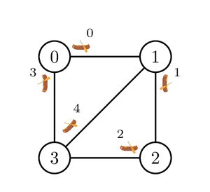

# Thousands Islands

Thousands Islands is a group of beautiful islands located in the Java Sea.
It consists of $N$ islands, numbered from $0$ to $N - 1$.

There are $M$ canoes, numbered from $0$ to $M - 1$, that can be used to sail between islands.
For each $i$ such that $0 \le i \le M - 1$, canoe $i$ can be docked either at island $U[i]$ or $V[i]$, and can be used to sail between islands $U[i]$ and $V[i]$.
Specifically, when the canoe is docked at island $U[i]$, it can be used to sail from island $U[i]$ to island $V[i]$, after which the canoe becomes docked at island $V[i]$.
Similarly, when the canoe is docked at island $V[i]$, it can be used to sail from island $V[i]$ to island $U[i]$, after which the canoe becomes docked at island $U[i]$.
Initially, the canoe is docked at island $U[i]$.
It is possible that multiple canoes can be used to sail between the same pair of islands.
It is also possible that multiple canoes are docked at the same island.

For safety reasons, a canoe needs to be maintained after every time it is sailed, which forbids the same canoe to be sailed two times in a row.
That is, after using some canoe $i$, another canoe must be used before canoe $i$ can be used again.

Bu Dengklek wants to plan a journey through some of the islands.
Her journey is **valid** if and only if the following conditions are satisfied.
* She starts and ends her journey at island $0$.
* She visits at least one island other than island $0$.
* After the journey ends, each canoe is docked at the same island as it was before the journey.
  I.e., canoe $i$, for each $i$ such that $0 \le i \le M - 1$, must be docked at island $U[i]$.

Help Bu Dengklek find any valid journey involving sailing at most $2\;000\;000$ times, or determine that no such valid journey exists.
It can be proven that under the constraints specified in this task (see Constraints section), if a valid journey exists, there also exists a valid journey that does not involve sailing more than $2\;000\;000$ times.


## Implementation Details

You should implement the following procedure:

```
union(bool, int[]) find_journey(int N, int M, int[] U, int[] V)
```

* $N$: the number of islands.
* $M$: the number of canoes.
* $U$, $V$: arrays of length $M$ describing the canoes.
* This procedure should return either a boolean or an array of integers.
  * If no valid journey exists, the procedure should return `false`.
  * If a valid journey exists, you have two options:
    * To be awarded the full score, the procedure should return an array of at most $2\;000\;000$ integers representing a valid journey. More precisely, the elements of this array should be the numbers of the canoes that are used in the journey (in the order they are used).
    * To be awarded a partial score, the procedure should return `true`, an array of more than $2\;000\;000$ integers, or an array of integers not describing a valid journey. (See the Subtasks section for more details.)
* This procedure is called exactly once.


## Examples

### Example 1

Consider the following call:

```
find_journey(4, 5, [0, 1, 2, 0, 3], [1, 2, 3, 3, 1])
```

The islands and canoes are shown in the picture below.



One possible valid journey is as follows.
Bu Dengklek first sails canoes $0$, $1$, $2$, and $4$ in that order.
As a result, she is at island $1$.
After that, Bu Dengklek can sail canoe $0$ again as it is currently docked at island $1$ and the last canoe she used is not canoe $0$.
After sailing canoe $0$ again, Bu Dengklek is now at island $0$.
However, canoes $1$, $2$ and $4$ are not docked at the same islands as they were before the journey.
Bu Dengklek then continues her journey by sailing canoes $3$, $2$, $1$, $4$, and $3$ again.
Bu Dengklek is back at island $0$ and all the canoes are docked at the same islands as before the journey.

Therefore, the returned value $[0, 1, 2, 4, 0, 3, 2, 1, 4, 3]$ represents a valid journey.

### Example 2

Consider the following call:

```
find_journey(2, 3, [0, 1, 1], [1, 0, 0])
```

The islands and canoes are shown in the picture below.


Bu Dengklek can only start by sailing canoe $0$, after which she can sail either canoe $1$ or $2$.
Note that she cannot sail canoe $0$ twice in a row.
In both cases, Bu Dengklek is back at island $0$.
However, the canoes are not docked at the same islands as they were before the journey, and Bu Dengklek cannot sail any canoe afterwards, as the only canoe docked at island $0$ is the one she has just used.
As there is no valid journey, the procedure should return `false`.


## Constraints

* $2 \le N \le 100\;000$
* $1 \le M \le 200\;000$
* $0 \le U[i] \le N - 1$ and $0 \le V[i] \le N - 1$ (for each $i$ such that $0 \le i \le M - 1$)
* $U[i] \neq V[i]$ (for each $i$ such that $0 \le i \le M - 1$)


## Subtasks

1. (5 points) $N = 2$
1. (5 points) $N \le 400$.
For each pair of distinct islands $x$ and $y$ ($0 \le x \lt y \le N - 1$), there are exactly two canoes that can be used to sail between them.
One of them is docked at island $x$, and the other one is docked at island $y$.
1. (21 points) $N \le 1000$, $M$ is even, and for each **even** $i$ such that $0 \le i \le M - 1$, canoes $i$ and $i + 1$ can both be used to sail between islands $U[i]$ and $V[i]$.
Canoe $i$ is initially docked at island $U[i]$ and canoe $i + 1$ is initially docked at island $V[i]$.
Formally, $U[i] = V[i + 1]$ and $V[i] = U[i + 1]$.
1. (24 points) $N \le 1000$, $M$ is even, and for each **even** $i$ such that $0 \le i \le M - 1$, canoes $i$ and $i + 1$ can both be used to sail between islands $U[i]$ and $V[i]$.
Both canoes are initially docked at island $U[i]$.
Formally, $U[i] = U[i + 1]$ and $V[i] = V[i + 1]$.
1. (45 points) No additional constraints.

For each test case in which a valid journey exists, your solution:
  * gets full points if it returns a valid journey,
  * gets $35\%$ of the points if it returns `true`, an array of more than $2\;000\;000$ integers, or an array that does not describe a valid journey,
  * gets $0$ points otherwise.

For each test case in which a valid journey does not exist, your solution:
  * gets full points if it returns `false`,
  * gets $0$ points otherwise.

Note that the final score for each subtask is the minimum of the points for the test cases in the subtask.


## Sample Grader

The sample grader reads the input in the following format:

* line $1$: $N \; M$
* line $2 + i$ ($0 \le i \le M - 1$): $U[i] \; V[i]$

The sample grader prints your answers in the following format:

* If `find_journey` returns a `bool`:
  * line $1$: $0$
  * line $2$: $0$ if `find_journey` returns `false`, or $1$ otherwise.
* If `find_journey` returns an `int[]`, denote the elements of this array by $c[0], c[1], \ldots c[k-1]$. The sample grader prints:
  * line $1$: $1$
  * line $2$: $k$
  * line $3$: $c[0] \; c[1] \; \ldots \; c[k-1]$
