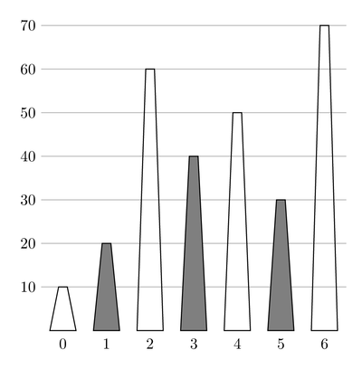

# Radio Towers

There are $N$ radio towers in Jakarta.
The towers are located along a straight line and numbered from $0$ to $N - 1$ from left to right.
For each $i$ such that $0 \le i \le N - 1$, the height of tower $i$ is $H[i]$ metres.
The heights of the towers are **distinct**.

For some positive interference value $\delta$, a pair of towers $i$ and $j$ (where $0 \le i \lt j \le N - 1$) can communicate with each other if and only if there is an intermediary tower $k$, such that
* tower $i$ is to the left of tower $k$ and tower $j$ is to the right of tower $k$, that is, $i \lt k \lt j$, and
* the heights of tower $i$ and tower $j$ are both at most $H[k] - \delta$ metres.

Pak Dengklek wants to lease some radio towers for his new radio network.
Your task is to answer $Q$ questions of Pak Dengklek which are of the following form:
given parameters $L, R$ and $D$ ($0 \le L \le R \le N - 1$ and $D > 0$), what is the maximum number of towers Pak Dengklek can lease, assuming that
 * Pak Dengklek can only lease towers with indices between $L$ and $R$ (inclusive), and
 * the interference value $\delta$ is $D$, and
 * any pair of radio towers that Pak Dengklek leases must be able to communicate with each other. 

Note that two leased towers may communicate using an intermediary tower $k$, regardless of whether tower $k$ is leased or not.


## Implementation Details

You should implement the following procedures:

```
void init(int N, int[] H)
```

* $N$: the number of radio towers.
* $H$: an array of length $N$ describing the tower heights.
* This procedure is called exactly once, before any calls to `max_towers`.

```
int max_towers(int L, int R, int D)
```

* $L$, $R$: the boundaries of a range of towers.
* $D$: the value of $\delta$.
* This procedure should return the maximum number of radio towers Pak Dengklek can lease for his new radio network if he is only allowed to lease towers between tower $L$ and tower $R$ (inclusive) and the value of $\delta$ is $D$.
* This procedure is called exactly $Q$ times.


## Example

Consider the following sequence of calls:

```
init(7, [10, 20, 60, 40, 50, 30, 70])
```

```
max_towers(1, 5, 10)
```

Pak Dengklek can lease towers $1$, $3$, and $5$.
The example is illustrated in the following picture, where shaded trapezoids represent leased towers.



Towers $3$ and $5$ can communicate using tower $4$ as an intermediary, since $40 \le 50 - 10$ and $30 \le 50 - 10$.
Towers $1$ and $3$ can communicate using tower $2$ as an intermediary.
Towers $1$ and $5$ can communicate using tower $3$ as an intermediary.
There is no way to lease more than $3$ towers, therefore the procedure should return $3$.

```
max_towers(2, 2, 100)
```

There is only $1$ tower in the range, thus Pak Dengklek can only lease $1$ tower.
Therefore the procedure should return $1$.

```
max_towers(0, 6, 17)
```

Pak Dengklek can lease towers $1$ and $3$.
Towers $1$ and $3$ can communicate using tower $2$ as an intermediary, since $20 \le 60 - 17$ and $40 \le 60 - 17$.
There is no way to lease more than $2$ towers, therefore the procedure should return $2$.


## Constraints

* $1 \le N \le 100\;000$
* $1 \le Q \le 100\;000$
* $1 \le H[i] \le 10^9$ (for each $i$ such that $0 \le i \le N - 1$)
* $H[i] \ne H[j]$ (for each $i$ and $j$ such that $0 \le i \lt j \le N - 1$)
* $0 \le L \le R \le N - 1$
* $1 \le D \le 10^9$


## Subtasks

1. (4 points) There exists a tower $k$ ($0 \le k \le N - 1$) such that
    * for each $i$ such that $0\le i\le k-1$: $H[i] \lt H[i + 1]$, and
    * for each $i$ such that $k \le i \le N - 2$: $H[i] \gt H[i + 1]$.
1. (11 points) $Q = 1$, $N \le 2000$
1. (12 points) $Q = 1$
1. (14 points) $D = 1$
1. (17 points) $L = 0$, $R = N - 1$
1. (19 points) The value of $D$ is the same across all `max_towers` calls.
1. (23 points) No additional constraints.


## Sample Grader

The sample grader reads the input in the following format:

* line $1$: $N \; Q$
* line $2$: $H[0] \; H[1] \; \ldots \; H[N - 1]$
* line $3 + j$ ($0 \le j \le Q - 1$): $L \; R \; D$ for question $j$

The sample grader prints your answers in the following format:

* line $1 + j$ ($0 \le j \le Q - 1$): the return value of `max_towers` for question $j$
