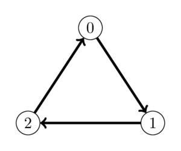
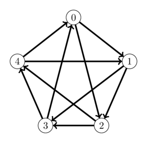

# Connected Towns

Pak Dengklek lives in Indonesia, a country consisting of $N$ towns numbered from $0$ to $N - 1$.
For every pair of towns, there is a one-way road going from one town to the other.
Pak Dengklek has no information on the direction of the roads, but Pak Chanek has offered to help him.

Pak Dengklek is allowed to ask Pak Chanek at most $40\;000$ questions.
For each question in turn, Pak Dengklek chooses a pair of towns and Pak Chanek tells him the direction of the road connecting those two towns.

Pak Dengklek wants to know a town number with at most one outgoing road, or report if there is no such town.
If there is more than one such town, Pak Dengklek only needs to know any of such town numbers.


## Implementation Details

You should implement the following procedure:

```
int find_town(int N)
```

* $N$: the number of towns in Indonesia.
* This procedure should return any town number with at most one outgoing road, or $-1$ if there is no such town.
* This procedure is called exactly once.

The above procedure can make calls to the following procedure:

```
bool check_road(int A, int B)
```

* $A, B$: a pair of town numbers to be asked to Pak Chanek.
* $A$ and $B$ must be **distinct** integers from $0$ to $N - 1$ inclusive.
* The procedure returns `true` if there is a road going from town $A$ to town $B$ and returns `false` if there is a road going from town $B$ to town $A$.
* This procedure can be called at most $40\;000$ times.


## Example

### Example 1

Consider a scenario in which there are $3$ towns and the roads connecting the towns are illustrated by the following image:



The procedure `find_town` is called in the following way:

```
find_town(3)
```

This procedure may call `check_road(0, 1)`, which (in this scenario) returns `true`. At this point, there is sufficient information to conclude that town $1$ has at most one outgoing road.
Therefore, the procedure may return $1$.

Additionally, this procedure may call `check_road(2, 1)`, which (in this scenario) returns `false`. At this point, there is sufficient information to conclude that town $2$ has at most one outgoing road.
Therefore, the procedure may also return $2$.

### Example 2

Consider a scenario in which there are $5$ towns and the roads connecting the towns are illustrated by the following image:



The procedure `find_town` is called in the following way:

```
find_town(5)
```

In this scenario, there is no town with at most one outgoing road.
Therefore, the procedure should return $-1$.


## Constraints

* $3 \le N \le 2000$


## Subtasks

1. (10 points) $N \le 250$
1. (90 points) No additional constraints.

In subtask 2 you can obtain a partial score.
Let $Q$ be the maximum number of calls to the procedure `check_road` across all test cases in this subtask.
Your score for this subtask is calculated according to the following table:

| Condition                   | Points                                  |
| --------------------------- | --------------------------------------- |
| $20\;000 \lt Q \le 40\;000$ | $20$                                    |
| $8000 \lt Q \le 20\;000$    | $90 - 70 \sqrt{\frac{Q - 8000}{12000}}$ |
| $Q \le 8000$                | $90$                                    |


## Grading

In some test cases, the behaviour of the grader is adaptive.
This means that in these test cases the grader does not have a fixed configuration of road directions.
Instead, the answers given by the grader may depend on the questions asked by your solution.
It is guaranteed that the grader answers in such a way that after each answer there is at least one configuration of road directions consistent with all the answers given so far.


## Sample Grader

The sample grader reads an array $R$ of $N$ strings with $N$ characters representing the roads in Indonesia.
For each $i$ and $j$ such that $0 \le i, j \le N - 1$ ($i \ne j$), $R[i][j]$ is `1` if there is a road going from town $i$ to town $j$ and $R[i][j]$ is `0` if there is a road going from town $j$ to town $i$.
For each $i$ such that $0 \le i \le N - 1$, $R[i][i]$ should be `0`.

The sample grader reads input in the following format:

* line $1$: $N$
* line $2 + i$ ($0 \le i \le N - 1$): $R[i]$

If the sample grader detects a protocol violation, the output of the sample grader is `Protocol Violation: <MSG>`, where `<MSG>` is one of the following:

* `too many questions`: `check_road` is called more than $40\;000$ times.
* `invalid parameters`: `check_road` is called with $A$ and $B$ are not distinct integers from $0$ to $N - 1$ inclusive.

Otherwise, the output of the sample grader is in the following format:

* line $1$: the return value of `find_town`.
* line $2$: the number of calls to `check_road`.

Note that the sample grader is not adaptive.
